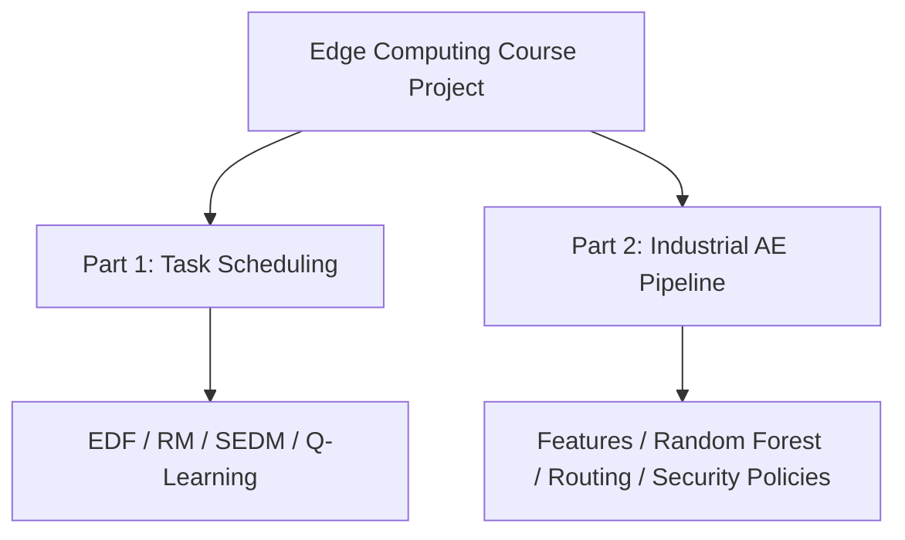

# Edge Scheduling and Privacy-Aware Industrial Analytics

A two-part **Edge Computing course project** exploring:

1. real-time task scheduling and offloading across heterogeneous edge nodes; and
2. privacy-aware processing of synthetic Acoustic Emission (AE) signals in an industrial edge environment.

Both components are simulation-based educational implementations. They are intended to demonstrate scheduling, machine-learning, security-policy, and edge-system concepts rather than production deployment or real-world clinical/industrial validation.

## Project Components

| Component | Focus | Main methods |
|---|---|---|
| [`part1/`](part1/) | Heterogeneous real-time task scheduling | EDF, Rate Monotonic, slack-and-energy heuristic, tabular Q-learning |
| [`part2/`](part2/) | Industrial AE analysis and privacy-aware routing | Signal features, Random Forest, rule-based edge decisions, Data Passports, Zero Trust checks |



## Part 1: Heterogeneous Edge Task Scheduling

Part 1 implements a discrete-event-style simulator for assigning periodic, sporadic, and aperiodic real-time tasks to four heterogeneous edge nodes. Nodes differ in processing speed, active and idle power, and communication delay.

The simulator evaluates three workload levels:

- low load;
- medium load; and
- overload.

### Implemented schedulers

- **Earliest Deadline First (EDF):** selects the ready task with the earliest absolute deadline and assigns it to the node with the earliest predicted completion time.
- **Rate Monotonic (RM):** prioritizes periodic tasks according to their periods and gives lower priority to non-periodic tasks.
- **SEDM heuristic:** selects tasks using dynamic slack and maps them to deadline-feasible nodes using a weighted finish-time and energy cost.
- **Tabular Q-learning:** learns a node-selection policy from urgency, system load, least-loaded node, and task type.

### Reported metrics

- deadline-miss ratio;
- average response time;
- estimated energy consumption; and
- estimated node utilization.

### Reference simulation output

The following overload results are reproduced by the current code with seed `42`:

| Scheduler | Miss ratio | Average response | Estimated energy |
|---|---:|---:|---:|
| EDF | 2.91% | 11.108 ms | 22.3159 J |
| RM | 4.85% | 11.184 ms | 22.2064 J |
| SEDM heuristic | 6.55% | 11.787 ms | 22.1792 J |
| Q-learning | 1.70% | 11.412 ms | 22.2886 J |

These numbers describe this synthetic simulator configuration only. The Q-learning agent is currently trained and evaluated on the same generated task set, so the table is **not evidence of generalization to unseen workloads**.


## Part 2: Industrial Acoustic-Emission Edge Pipeline

Part 2 models an educational industrial-edge scenario in which Acoustic Emission signals from equipment such as pumps, compressors, turbines, and bearings are processed under latency, network, privacy, and trust constraints.

The end-to-end pipeline contains the following stages:

1. Generate 80 synthetic AE windows covering normal behavior and six modeled anomaly/fault categories.
2. Extract 12 time-domain, frequency-domain, and burst-related features.
3. Train a small Random Forest classifier as a lightweight state detector.
4. Create a Data Passport describing allowed data forms, transfer restrictions, retention policy, and audit requirements.
5. Apply a context-aware rule engine to select a processing location and maintenance action.
6. Evaluate conceptual Zero Trust access checks, including least-privilege denial and emergency break-glass access.
7. Simulate normal, degraded, and offline network conditions.
8. Compare the rule engine with cloud-first and latency-first baselines.

### Extracted AE features

The feature extractor calculates:

- RMS;
- peak amplitude;
- crest factor;
- signal energy;
- zero-crossing rate;
- kurtosis and skewness;
- signal entropy;
- dominant frequency;
- spectral centroid;
- band-power ratio; and
- burst count.

### Privacy and security-policy simulation

The project models:

- raw, feature, summary, and alert-only data forms;
- non-transferable and confidential data restrictions;
- node identity, permission, and trust checks;
- audit requirements;
- forbidden processing destinations; and
- emergency break-glass access with logging.

The Zero Trust component is a **policy simulation**. It does not implement production authentication, encryption, remote attestation, or a real policy-enforcement infrastructure.

### Generated outputs

The Part 2 pipeline writes metadata, extracted features, decisions, policy logs, scenario results, baseline comparisons, and comparison charts to `part2/outputs/`.

The current dataset is synthetic and intentionally small. Reported classifier scores should therefore be treated as implementation sanity checks, not evidence of performance on real industrial AE data.

## Repository Structure

```text
.
├── README.md
├── requirements.txt
├── part1/
│   ├── algorithms.py
│   ├── config.py
│   ├── core.py
│   ├── main.py
│   ├── scheduler.py
│   ├── simulation.py
│   ├── task.py
│   ├── task_generator.py
│   ├── visualisation.py
│   └── outputs/
└── part2/
    ├── baseline.py
    ├── data_generator.py
    ├── decision_engine.py
    ├── feature_extractor.py
    ├── main.py
    ├── model.py
    ├── passport.py
    ├── simulation.py
    ├── zero_trust.py
    └── outputs/
```

Generated `__pycache__/` directories and `.pyc` files should not be committed.

## Installation

Create and activate a virtual environment:

```bash
python -m venv .venv
source .venv/bin/activate
```

On Windows:

```powershell
.venv\Scripts\activate
```

Install the dependencies:

```bash
pip install -r requirements.txt
```

The project uses NumPy, pandas, Matplotlib, SciPy, and scikit-learn.

## Running Part 1

Run the scheduling experiments from the Part 1 directory:

```bash
cd part1
python main.py
```

The script generates task datasets, evaluates all four schedulers, writes `q4_results.csv`, and produces comparison and Gantt charts in `part1/outputs/`.

## Running Part 2

Run the industrial AE pipeline from the Part 2 directory:

```bash
cd part2
python main.py
```

The script generates synthetic signals, extracts features, trains the classifier, creates Data Passports, evaluates routing and Zero Trust scenarios, and writes the results to `part2/outputs/`.

## Current Limitations

### Part 1

- The workload and platform are synthetic.
- Q-learning is trained and evaluated on the same task set; separate training and evaluation seeds are needed for a generalization study.
- The energy model is simplified.
- The current utilization calculation is based on node timelines and should be replaced by accumulated active execution time for a conventional utilization metric.
- Scheduling and communication are represented using a simplified non-preemptive model.

### Part 2

- AE signals are synthetic and the dataset contains only 80 samples.
- The generated dataset is not globally seeded, so Part 2 results can change between runs.
- The current decision rule usually selects the lowest-latency sensor, limiting meaningful comparison among edge, datacenter, and cloud destinations.
- The classifier is fitted on the generated dataset used by the pipeline; a separate held-out evaluation set is required.
- Cross-validation preprocessing should be moved into a scikit-learn `Pipeline` to avoid fitting preprocessing outside each fold.
- Zero Trust and Data Passport behavior is simulated rather than connected to real security infrastructure.

## Recommended Next Steps

- Evaluate Q-learning on task sets generated with unseen seeds.
- Correct the Part 1 utilization calculation and validate the energy model.
- Add command-line configuration for seeds, workload sizes, simulation horizon, and learning parameters.
- Seed both Python and NumPy in Part 2 and store experiment configuration with each output.
- Use a held-out dataset or out-of-fold predictions for the Part 2 decision pipeline.
- Model processing capability and model availability at each layer so Part 2 routing is not determined by latency alone.
- Align node identifiers across the routing, Data Passport, and Zero Trust modules.
- Add automated tests for scheduling decisions, privacy restrictions, and break-glass behavior.
- Retain selected result plots while excluding caches and disposable generated files from version control.

## Course Context

This repository was developed as an Edge Computing course project at Sharif University of Technology. Part 1 and Part 2 correspond to separate course tasks collected in one repository.

## Disclaimer

This repository is intended for education and simulation. It should not be used for production scheduling, industrial fault diagnosis, or security enforcement without substantial validation and engineering work.
